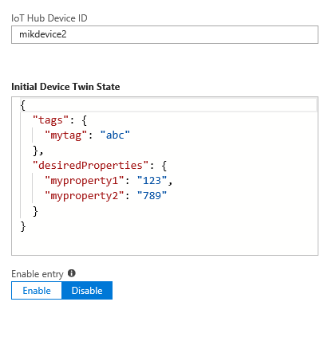

# Example of device provisioning in a factory 
We ran into a customer that produce an IoT concentrator used within different types of machines ranging from industrial to vending machines. 
In this scenario, there are three "players" involved: The concentrator manufacturer, the machine manufacturer and the machines' end customers. The goal of the sample solution is to support all those three actors with a friction-less device activation. 

# Disclaimer
This is a sample solution to illustrate a possible usage of DPS in a factory-oriented scenario. It is by no means a security best practice and it should be taken as a sample only. The assumption of this sample is that devices don't support TPM or HSM, hence usage of certificate-based authentication. Certificate generation and workflow is also in a simplified state and should not be taken as best practice.

# Try it out
To deploy this architecture on your Azure subscription, simply click on the button here below and provide with a unique name. Below, you will find information on the exact customer flow and how to use the deployed architecture.
<a href="https://portal.azure.com/#create/Microsoft.Template/uri/https%3A%2F%2Fraw.githubusercontent.com%2FMandur%2FDeviceProvisioningDemo%2Fmaster%2Fazuredeploy.json" target="_blank">
    
</a>

When you finish deploying the template, you should receive values as output, please copy them as you will need them later.

# Flow


1. Concentrator is manufactured at the factory floor.
2. Concentrator is served with correct image and dependencies, typically through a server local to the factory floor.
    1. Concentrator is provisioned with OS image, dependencies, applications and everything needed for him to run.
    2. Concentrator's Leaf certificates are generated with a specific hardware id (GUID=RegistrationID=DeviceID). Typically, the GUID is printed on a label located on the concentrator board.
    3. The leaf certificate is installed on the Concentrator.
    4. The server contacts the Azure DPS to provision the concentrator in the enrollment list. It uploads the leaf certificate and set provisioning status to disabled in order to forbid registration without providing further information by end-customer. This behavior is to prevent that the Concentrator is enabled before the correct information have been provided by the machine manufacturer.
3. Concentrator is shipped to the machine manufacturer. 
    1. On reception, the latter activates the Concentrator on a web portal, adding the metadata information (e.g. location, chassis number...) needed for the machine to run correctly.
    2. On activation request, the customer portal call the DPS to make it end-customer ready:
        * Provision the metadata as Concentrator Twins
        * Set the provisionStatus as enabled 
        * Set the IoT Hub on which the Concentrator will be connected to
    3. Concentrator is mounted inside the machine and is sent to the end-customer
4. When the customers received the machine: 
    1. At first boot, the machine will connect to the DPS for enrollment. It sends the leaf certificate provisioned on the concentrator in step 2.ii as Authentication mechanism. DPS will do the Concentrator registration on the IoT Hub assigned in the steps before and send back its connection information to the machine.
    2. Machine can now speak with the IoT hub using connection that was sent back in the previous step. The leaf certificate will be used as authentication mechanism. 

# Components
Device Provisioning Service
IoT Hub(s)
Factory Server
Device provisioning Library
Custom end user Portal


# How to use it
Provision the Id_scope and the factory floor website url in the file located on ./client/.env. To do so, just copy the strings between the quotes marks and you should be ready to provision your first Concentrator!

1. Simulate Concentrator creation
In this section we are going to simulate the Concentrator creation and provision. To do it, go to the client folder and type the following command:

``` 
npm install
node provisionDevice.js <desiredDeviceId>
```

This script will ask your factory floor server to generate new device keys, provision them on the Concentrator and create a device entry into our IoT Device Provisioning system. In this step, Concentrator created in the DPS will be set as inactive to avoid activation before the machine manufacturer could provision them with required information as in the following picture. You can see it by going to the DPS deployed in your Azure subscription and go to the blade "Manage enrollments"-> "Individual Enrollment".



Note that in this example the keys generated client side are stored in plain on the normal file system, this is definitely not a security best practice and you should save them in a secure location as they will serve as device authentication for the next steps. 

You can find the server code answering to the client under the path ./server/FactoryServer.

2. Activate the Concentrator
In this section we assume the Concentrator has been issued to the machine manufacturer and he wants to activate it and provision it with the Concentrator information relevant for his application/machin use-case. To do so, open your favorite we browser and got to the URL of the customer portal. You will find a simple entry form asking you for the device Id and the desired device properties that will be uploaded in your device Twin. those properties have to be entered in the following format : 

```
{"tags": {
      "mytag": "abc"
    },
    "properties": {
      "desired": {
        "myproperty1": "123",
        "myproperty2": "789"
      }
    }
}
```
Once this has been done, the Concentrator will be set to active and will be ready for end-user activation

NB. the portal here is barely minimal and does very few verifications on the user form. It is here for demonstration only and we do expect each manufacturer to do its own implementation.

3. Concentrator first startup
Finally ,when the Concentrator arrives at an end customer location, he is not yet assigned to an IoT Hub, assignation will occur on first device connection. To achieve this, go to ./client/ and type

```
node firstRun.js <desiredDeviceId>
```

This script will contact the DPS to provision to his assigned IoT Hub using the certificate generated in 1 as authentication. In our demo case, we only have a single attached IoT Hub, but you could add additional one and balance assignation between them. Once provisioning is successful, DPS will return the IoT hub URL of the assigned hub and the script will use it to send message every five seconds. You can now watch your IoT hub receiving messages! 
